# Product Requirements Document (PRD)
## OpenEXA Chat - Cloud-Deployed React Development Demo

**Version:** 1.0  
**Date:** January 17, 2026  
**Status:** Active Development  
**Last Updated:** January 17, 2026

---

## Table of Contents
1. [Executive Summary](#1-executive-summary)
2. [Product Overview](#2-product-overview)
3. [Feature Set](#3-feature-set)
4. [Technical Architecture](#4-technical-architecture)
5. [File Structure & Components](#5-file-structure--components)
6. [API Integration](#6-api-integration)
7. [Data Schema](#7-data-schema)
8. [User Workflows](#8-user-workflows)
9. [Non-Functional Requirements](#9-non-functional-requirements)
10. [Future Enhancements](#10-future-enhancements)
11. [Success Metrics](#11-success-metrics)
12. [Constraints & Assumptions](#12-constraints--assumptions)
13. [Glossary](#13-glossary)

---

## 1. Executive Summary

**OpenEXA Chat** is a full-stack React application combining real-time financial data visualization with an AI-powered chat interface. It enables users to:

- Conduct multi-session chat conversations with an n8n-powered backend
- View live candlestick chart visualizations of financial data
- Manage multiple independent chat sessions with persistent storage
- Configure application settings (webhooks, chart dimensions) via modal UI

The application uses **browser localStorage** for state persistence, eliminating the need for a backend database. A simple **Express server** (localhost:4000) acts as a data relay between n8n workflows and the React frontend.

### System Architecture Overview


---

## 2. Product Overview

### 2.1 Purpose
Provide a seamless interface for users to:
- Conduct organized, multi-session chat conversations with external AI/workflow systems
- View live candlestick financial data alongside chat
- Persist application state across browser sessions without authentication
- Integrate with n8n workflow automation platform

### 2.2 Target Users
- **Financial Analysts** - Quick access to chat + chart for market analysis
- **Workflow Developers** - Testing n8n webhook integrations
- **Power Users** - Managing multiple independent chat sessions
- **Demo Audiences** - Showcasing OpenEXA capabilities in cloud deployments

### 2.3 Core Stack

| Layer | Technology |
|-------|-----------|
| **Frontend** | React 18 (Vite) + JSX |
| **Styling** | Tailwind CSS + PostCSS |
| **Animation** | Framer Motion |
| **Icons** | Lucide React |
| **Charts** | CanvasJS (candlestick) |
| **Backend** | Node.js + Express |
| **Storage** | Browser localStorage |
| **Integration** | n8n Webhooks |
| **Build Tool** | Vite |
| **Linting** | ESLint |

---

## 3. Feature Set

### 3.1 Chat Management

#### Multi-Session Architecture
- **Create Sessions:** "New" button generates session with auto-incremented name
- **Session Persistence:** All sessions stored in localStorage under `openexa-chat-sessions-v1`
- **Session Metadata:**
  - Unique ID (generated via `uid()` function)
  - Custom name (editable)
  - Associated chatId for n8n
  - Creation timestamp
  - Complete message history
- **Delete Sessions:** Confirmation-less immediate deletion
- **Rename Sessions:** In-line rename with prompt dialog

#### Session Storage Schema
```javascript
{
  order: ["id1", "id2", "id3"],           // Display order
  byId: {
    "id1": {
      id: "id1",
      name: "Financial Analysis",
      chatId: "id1",
      messages: [
        { who: "you", text: "What is the 15min trend?", ts: 1705500000 },
        { who: "bot", text: "Uptrend continuing...", ts: 1705500005 }
      ],
      created: 1705500000
    }
  },
  activeId: "id1"
}
```

### 3.2 Messaging System

#### Message Flow Diagram


#### Message Structure
```javascript
{
  who: "you" | "bot",         // Sender indicator
  text: string,               // Message content
  ts: number                  // Timestamp (Date.now())
}
```

#### UI Behaviors
- **User Messages:** Indigo/violet right-aligned styling
- **Bot Messages:** White left-aligned styling
- **Typing Indicator:** `TypingDots` animation during `busy` state
- **Error Messages:** Network errors displayed as bot messages
- **Time Display:** `timeAgo()` helper shows "5m ago", "2h ago", etc.

#### Key State Variables
```javascript
const [input, setInput] = useState("");           // Textarea content
const [busy, setBusy] = useState(false);          // Sending/waiting state
const [status, setStatus] = useState("");         // Status text from server
const [progress, setProgress] = useState([]);     // Step-by-step progress array
```

### 3.3 Candlestick Chart Visualization

#### Data Pipeline Diagram


#### Data Structure (From Server)
```json
{
  "Body": "Latest market status",
  "Candlestick": {
    "symbol": "AAPL",
    "allCandles": [
      {
        "candles": {
          "Time Series (15min)": {
            "2026-01-17 10:00:00": {
              "1. open": "150.25",
              "2. high": "151.50",
              "3. low": "150.00",
              "4. close": "151.00",
              "5. volume": "1000000"
            },
            "2026-01-17 09:45:00": { ... }
          }
        }
      }
    ]
  }
}
```

#### Chart Features
- **Color Coding:**
  - Green candles: Close ≥ Open (bullish)
  - Red candles: Close < Open (bearish)
- **Configurable Dimensions:**
  - Width (0 = full container width)
  - Height (pixels, e.g., 320)
  - Candle width (4–12 px recommended)
- **Responsive:** Adapts to right-panel size
- **Real-Time Updates:** 1 Hz polling refresh rate

### 3.4 Settings & Configuration

#### Settings Modal (`SettingsButton` Component)
Opens non-blocking modal dialog with:

1. **Webhook URL Input**
   - Placeholder: "https://n8n.example.com/webhook/..."
   - Required for chat functionality
   - Persisted to `openexa-chat-settings-v1`

2. **Chart Width Input**
   - Default: 900px
   - 0 = 100% container width
   - Number input or slider

3. **Chart Height Input**
   - Default: 320px
   - Numeric pixel value
   - Affects vertical chart space

4. **Candle Width Slider**
   - Range: 4–12 px
   - Default: 10px
   - Affects candle spacing and visibility

#### Settings Persistence
```javascript
{
  "openexa-chat-settings-v1": {
    webhookUrl: "https://n8n.example.com/webhook/abc123",
    chartWidth: 900,
    chartHeight: 320,
    candleWidth: 10
  }
}
```

### 3.5 UI/UX Components

#### Component Library

| Component | Purpose | Props |
|-----------|---------|-------|
| **Chip** | Status badge | `children` (text/nodes) |
| **GhostButton** | Transparent action button | `className`, `onClick`, etc. |
| **PrettyInput** | Auto-expanding textarea | `value`, `onChange`, `onKeyDown`, `placeholder` |
| **TypingDots** | Loading animation | None (self-contained) |
| **SettingsButton** | Settings modal dialog | `settings`, `setSettings` |
| **CandlestickChart** | Financial chart | `options`, `width`, `height`, `candleWidth` |

#### Layout Structure (Desktop)


#### Layout Structure (Mobile)
```
┌──────────────────────────────┐
│ Header (Menu + Status)       │
├──────────────────────────────┤
│ Chat Area (full width)       │
│ - Message List               │
│ - Input Field                │
├──────────────────────────────┤
│ Sidebar (hamburger menu)     │
│ or collapsible panel         │
└──────────────────────────────┘
```

#### Visual Effects
- **Glassmorphism:** Semi-transparent backgrounds with blur (Tailwind `backdrop-blur-md`)
- **Hover States:** `hover:bg-white/10` for interactive elements
- **Active States:** `active:scale-[0.98]` for button press feedback
- **Animations:** Framer Motion for modal/panel transitions
- **Color Scheme:**
  - User messages: Indigo (`text-indigo-400`, `bg-indigo-500/20`)
  - Bot messages: White (`text-white`, `bg-white/10`)
  - Accents: Violet (`focus:ring-violet-400`)

---

## 4. Technical Architecture

### 4.1 Component Hierarchy


### 4.2 Data Flow Diagram

#### Chat Message Flow


#### Chart Data Flow


### 4.3 State Management Strategy

#### localStorage-First Architecture
- **No backend database** - all state lives in browser
- **Keys:** Prefixed with `openexa-chat-` for namespacing
- **Custom Hook:** `useLocalStorage(key, initial)` handles sync
- **Immutability:** State updates create new object references

#### State Management Diagram


### 4.4 Server Architecture

#### Express API Design

**Port:** `4000`  
**CORS:** Enabled for all origins  
**Body Parser:** JSON middleware

##### Endpoints

###### POST /data
- **Purpose:** Receive candlestick data from n8n workflow
- **Request Body:** Any JSON (typically contains `Body` and `Candlestick`)
- **Response:**
  ```json
  { "success": true }
  ```
- **Behavior:** Stores payload in `latestPayload` variable (in-memory)
- **Console:** Logs "✅ Received data from n8n: ..."

###### GET /data
- **Purpose:** Return latest stored candlestick data to frontend
- **Response:** `latestPayload` or `{ "message": "No data yet" }`
- **Cache Headers:** Disabled (no-store, no-cache, must-revalidate)
- **Use Case:** React frontend polls every 1 second
- **Console:** No logging (frequent requests)

#### Server Architecture Diagram


#### Data Flow Through Server
```
n8n Workflow
  │
  ├─ Fetches financial data (API call)
  │
  ├─ Formats as JSON: { Body, Candlestick }
  │
  └─ POST http://localhost:4000/data
       │
       ▼
    Express Handler
       │
       ├─ Receives and validates JSON
       │
       ├─ Stores in latestPayload
       │
       └─ Responds { success: true }


React Frontend (1s interval)
  │
  └─ GET http://localhost:4000/data
       │
       ▼
    Express Handler
       │
       ├─ Reads latestPayload
       │
       └─ Responds with latest data
            │
            ▼
         React Chart Updates
```

---

## 5. File Structure & Components

### 5.1 Project Directory Tree
```
openexa-chat/
├── src/
│   ├── main.jsx                    # React app entry point
│   ├── App.jsx                     # Root wrapper component
│   ├── OpenEXAChat.jsx             # Main app logic & UI
│   ├── CandlestickChart.jsx        # Chart rendering component
│   ├── App.css                     # App-specific styles
│   ├── index.css                   # Global styles
│   └── assets/                     # Images, fonts, etc.
├── server/
│   ├── server.js                   # Express API server
│   └── package.json                # Server dependencies
├── public/
│   ├── index.html                  # HTML template
│   └── favicon.ico
├── package.json                    # Frontend dependencies
├── vite.config.js                  # Vite build config
├── tailwind.config.js              # Tailwind CSS config
├── postcss.config.js               # PostCSS config
├── eslint.config.js                # ESLint rules
└── PRD.md                          # This document
```

### 5.2 File Descriptions

#### **src/main.jsx**
- **Type:** Entry point
- **Purpose:** Bootstrap React app and mount to DOM
- **Typical Content:**
  ```javascript
  import React from 'react'
  import ReactDOM from 'react-dom/client'
  import App from './App.jsx'
  import './index.css'
  
  ReactDOM.createRoot(document.getElementById('root')).render(
    <React.StrictMode>
      <App />
    </React.StrictMode>,
  )
  ```

#### **src/App.jsx**
- **Type:** Root component wrapper
- **Purpose:** Top-level layout and routing (if any)
- **Likely Content:**
  ```javascript
  import OpenEXAChat from './OpenEXAChat.jsx'
  
  export default function App() {
    return <OpenEXAChat />
  }
  ```

#### **src/OpenEXAChat.jsx** ✅
- **Type:** Main application component
- **Lines of Code:** ~400–500
- **Key Responsibilities:**
  1. Session management (CRUD operations)
  2. Chat messaging (send, receive, merge history)
  3. Chart data polling (1s interval)
  4. Settings persistence
  5. UI rendering (sidebar, chat, right panel)
  6. Modal management (settings dialog)

- **State Hooks:**
  - `useLocalStorage(LS_KEY, {})` → sessions
  - `useLocalStorage(LS_SETTINGS, {})` → settings
  - `useState("")` → input, status, candlestickText
  - `useState(false)` → busy, rightMenuOpen
  - `useState([])` → progress
  - `useState(null)` → chartOptions
  - `useRef(null)` → listRef (chat scroll)

- **Effect Hooks:**
  - Ensure default session exists
  - Auto-scroll chat to bottom
  - Clear chart on session change
  - Poll candlestick data (1s)

- **Sub-Components:**
  1. **Chip** - Status badge display
  2. **GhostButton** - Transparent button
  3. **PrettyInput** - Auto-expand textarea
  4. **TypingDots** - Animated loader
  5. **SettingsButton** - Modal settings form

#### **src/CandlestickChart.jsx** ❓
- **Type:** Chart visualization component
- **Purpose:** Render CanvasJS candlestick chart
- **Expected Props:**
  ```javascript
  {
    options: object,    // CanvasJS chart options
    width: number,      // Chart width (px)
    height: number,     // Chart height (px)
    candleWidth: number // Candle width (4–12 px)
  }
  ```

- **Expected Logic:**
  1. Receive `options` prop (CanvasJS format)
  2. Merge with chart dimensions
  3. Render using CanvasJS library (likely `react-canvasjs-chart` or direct library)
  4. Handle window resize (if responsive)
  5. Display title, legend, tooltips

- **Data Format Expected:**
  ```javascript
  const options = {
    title: { text: "AAPL 15min" },
    data: [{
      type: "candlestick",
      dataPoints: [
        { x: new Date(2026, 0, 17, 10, 0), y: [150.25, 151.50, 150.00, 151.00] },
        { x: new Date(2026, 0, 17, 9, 45), y: [149.50, 150.50, 149.00, 150.25] }
      ]
    }]
  };
  ```

#### **src/App.css** & **src/index.css**
- **Type:** Stylesheet
- **Purpose:** Global and app-specific CSS
- **Content:** Tailwind directives, animations, custom classes
- **Example:**
  ```css
  @tailwind base;
  @tailwind components;
  @tailwind utilities;
  
  @layer components {
    .chat-message {
      @apply p-3 rounded-lg break-words;
    }
  }
  ```

#### **server/server.js** ✅
- **Type:** Express API server
- **Port:** 4000
- **Dependencies:** `express`, `cors`
- **Endpoints:** POST /data, GET /data
- **Runtime:** Node.js (started separately from React dev server)

#### **package.json** (Frontend)
- **Dependencies (Expected):**
  - `react` - UI library
  - `react-dom` - DOM rendering
  - `framer-motion` - Animations
  - `tailwindcss` - Utility CSS
  - `lucide-react` - Icons
  - `canvasjs` or `react-canvasjs-chart` - Charts

- **Dev Dependencies (Expected):**
  - `@vitejs/plugin-react` - Vite React support
  - `@eslint/js` - Linting
  - `tailwindcss` - CSS framework
  - `autoprefixer` - CSS vendor prefixes
  - `postcss` - CSS processing

#### **vite.config.js**
- **Purpose:** Configure Vite bundler
- **Typical Content:**
  ```javascript
  import { defineConfig } from 'vite'
  import react from '@vitejs/plugin-react'
  
  export default defineConfig({
    plugins: [react()],
    server: { port: 3000, proxy: { '/api': 'http://localhost:4000' } }
  })
  ```

#### **tailwind.config.js**
- **Purpose:** Customize Tailwind CSS
- **Typical Content:**
  ```javascript
  export default {
    content: ['./index.html', './src/**/*.{js,jsx}'],
    theme: { extend: {} },
    plugins: []
  }
  ```

---

## 6. API Integration

### 6.1 n8n Webhook (Chat Backend)

#### Request & Response Flow


#### Request Format
```http
POST {settings.webhookUrl}
Content-Type: application/json

{
  "chatId": "abc123def456",
  "chatInput": "What is the market outlook?"
}
```

#### Response Format (Expected)
```json
{
  "status": "Processing your request...",
  "progress": [
    "Fetching market data...",
    "Analyzing trends...",
    "Generating response..."
  ],
  "history": [
    {
      "who": "you",
      "text": "What is the market outlook?",
      "ts": 1705500000
    },
    {
      "who": "bot",
      "text": "Based on current data, the market shows a bullish trend with strong support at 150.00 level.",
      "ts": 1705500005
    }
  ],
  "text": "Based on current data, the market shows a bullish trend with strong support at 150.00 level.",
  "sessionId": "abc123def456"
}
```

#### Error Handling
- **Network Error:** Caught in try-catch, displayed as bot message
- **Invalid Webhook URL:** Validation in settings modal
- **Timeout:** JavaScript fetch default (no explicit timeout set - consider adding)
- **Malformed Response:** Try-catch wraps JSON parsing

### 6.2 Data Server (Candlestick Relay)

#### Request Format
```http
GET http://localhost:4000/data
```

#### Response Format
```json
{
  "Body": "Latest market update for AAPL",
  "Candlestick": {
    "symbol": "AAPL",
    "meta": {
      "2. Symbol": "AAPL",
      "3. Last Refreshed": "2026-01-17 10:00:00"
    },
    "allCandles": [
      {
        "meta": { "2. Symbol": "AAPL" },
        "candles": {
          "Time Series (15min)": {
            "2026-01-17 10:00:00": {
              "1. open": "150.25",
              "2. high": "151.50",
              "3. low": "150.00",
              "4. close": "151.00",
              "5. volume": "1234567"
            },
            "2026-01-17 09:45:00": {
              "1. open": "149.50",
              "2. high": "150.50",
              "3. low": "149.00",
              "4. close": "150.25",
              "5. volume": "1100000"
            }
          }
        }
      }
    ]
  }
}
```

---

## 7. Data Schema

### 7.1 Core Data Structures

```mermaid
graph TB
    subgraph Session["Session Object"]
        S1["id: string"]
        S2["name: string"]
        S3["chatId: string"]
        S4["messages: Message[]"]
        S5["created: number"]
    end
    
    subgraph Message["Message Object"]
        M1["who: 'you' | 'bot'"]
        M2["text: string"]
        M3["ts: number"]
    end
    
    subgraph SessionState["Sessions Root"]
        SS1["order: string[]"]
        SS2["byId: {id → Session}"]
        SS3["activeId: string | null"]
    end
    
    subgraph Settings["Settings Object"]
        ST1["webhookUrl: string"]
        ST2["chartWidth: number"]
        ST3["chartHeight: number"]
        ST4["candleWidth: number"]
    end
    
    Session --> Message
    SessionState --> Session
    
    style Session fill:#bbdefb
    style Message fill:#c8e6c9
    style SessionState fill:#f8bbd0
    style Settings fill:#ffe0b2
```



### 7.2 Session Object
```typescript
interface Session {
  id: string;                    // Unique identifier (uid())
  name: string;                  // User-editable name
  chatId: string;                // ID sent to n8n webhook
  messages: Message[];           // Array of all messages
  created: number;               // Timestamp (Date.now())
}

interface Message {
  who: "you" | "bot";           // Sender type
  text: string;                 // Message content
  ts: number;                   // Timestamp (Date.now())
}
```

### 7.3 Sessions Root Object
```typescript
interface SessionsState {
  order: string[];              // Array of session IDs (for ordering)
  byId: { [id: string]: Session };  // Sessions indexed by ID
  activeId: string | null;      // Currently selected session ID
}
```

### 7.4 Settings Object
```typescript
interface Settings {
  webhookUrl: string;           // n8n webhook endpoint URL
  chartWidth: number;           // Chart width (0 = 100%, default 900)
  chartHeight: number;          // Chart height in pixels (default 320)
  candleWidth: number;          // Candle width 4–12 px (default 10)
}
```

### 7.5 Chart Options Object (CanvasJS)
```typescript
interface ChartOptions {
  title?: {
    text: string;
  };
  data: [{
    type: "candlestick";
    dataPoints: {
      x: Date;                  // Timestamp
      y: [open, high, low, close];  // OHLC values
    }[];
  }];
}
```

### 7.6 n8n Webhook Response
```typescript
interface WebhookResponse {
  status: string;               // Current status message
  progress?: string[];          // Array of progress steps
  history?: Message[];          // Server-authoritative message history
  text?: string;                // Bot response text
  sessionId?: string;           // Echo of session ID
  [key: string]: any;           // Additional fields (flexible)
}
```

### 7.7 Server Data Response
```typescript
interface ServerDataResponse {
  Body?: string;                // Status text
  Candlestick?: {
    symbol: string;
    meta?: { [key: string]: string };
    allCandles: [{
      meta?: { [key: string]: string };
      candles: {
        [timeSeriesKey: string]: {
          [timestamp: string]: {
            "1. open": string;
            "2. high": string;
            "3. low": string;
            "4. close": string;
            "5. volume": string;
          }
        }
      }
    }]
  };
  [key: string]: any;
}
```

---

## 8. User Workflows

### 8.1 Workflow: Start a New Chat Session

**Goal:** Create independent space for new conversation  
**Duration:** < 1 second

```mermaid
graph TD
    A["User Clicks<br/>New Button"] --> B["System Generates<br/>Unique ID"]
    B --> C["Create New Session<br/>Default Name"]
    C --> D["Add to Sessions List<br/>order + byId"]
    D --> E["Set as Active Session<br/>activeId"]
    E --> F["Update Sidebar<br/>Highlight New Session"]
    F --> G["Clear Chat Area<br/>Empty Message List"]
    G --> H["Focus Input Field<br/>Ready for Typing"]
    H --> I["Save to localStorage<br/>Persist"]
    I --> J["✅ Complete"]
    
    style A fill:#e8f5e9
    style I fill:#fff9c4
    style J fill:#c8e6c9
```



**Outcomes:**
- ✅ New session persisted to localStorage
- ✅ User ready to start chatting

---

### 8.2 Workflow: Send a Chat Message

**Goal:** Communicate with n8n workflow and receive response  
**Duration:** Varies (depends on n8n processing)

```mermaid
graph TD
    A["User Types Message<br/>Press Enter"] --> B["Validate Input"]
    B --> C{"Valid?"}
    C -->|No| D["⚠️ Show Error"]
    C -->|Yes| E["Optimistic UI:<br/>Add Message Immediately"]
    E --> F["Clear Input Field<br/>Set busy = true"]
    F --> G["POST to Webhook<br/>{chatId, chatInput}"]
    G --> H["Await Response<br/>Timeout: 30s"]
    H --> I{"Success?"}
    I -->|No| J["❌ Show Error Message"]
    I -->|Yes| K["Parse Response<br/>{status, progress, history}"]
    K --> L["Merge Histories<br/>Local + Server"]
    L --> M["Update React State<br/>messages, status, progress"]
    M --> N["Set busy = false<br/>Enable input"]
    N --> O["Re-render Chat UI<br/>Auto-scroll to bottom"]
    O --> P["Save to localStorage"]
    P --> Q["✅ Complete"]
    
    style A fill:#e8f5e9
    style E fill:#fff9c4
    style G fill:#bbdefb
    style K fill:#f8bbd0
    style P fill:#c8e6c9
    style Q fill:#c8e6c9
```



---

### 8.3 Workflow: View Candlestick Chart

**Goal:** Monitor live financial data visualization  
**Duration:** Continuous (1s polling)


---

### 8.4 Workflow: Configure Settings

**Goal:** Customize webhook, chart dimensions, and app behavior  
**Duration:** < 30 seconds

```mermaid
graph TD
    A["User Clicks<br/>Settings Button"] --> B["Open Modal Dialog"]
    B --> C["Display Form"]
    C --> C1["Webhook URL Input"]
    C --> C2["Chart Width Input"]
    C --> C3["Chart Height Input"]
    C --> C4["Candle Width Slider"]
    C1 --> D["User Modifies Fields"]
    C2 --> D
    C3 --> D
    C4 --> D
    D --> E{"User Action?"}
    E -->|Save| F["Validate Inputs"]
    E -->|Cancel| G["Close Modal<br/>Discard Changes"]
    F --> H{"Valid?"}
    H -->|No| I["Show Validation Error"]
    I --> D
    H -->|Yes| J["Update State"]
    J --> K["Save to localStorage<br/>openexa-chat-settings-v1"]
    K --> L["Apply Changes<br/>Chart re-renders<br/>Webhook URL updated"]
    L --> M["Close Modal"]
    M --> N["✅ Complete"]
    
    style A fill:#e8f5e9
    style F fill:#fff9c4
    style J fill:#bbdefb
    style K fill:#c8e6c9
    style N fill:#c8e6c9
```



---

## 9. Non-Functional Requirements

### 9.1 Performance

| Metric | Target | Notes |
|--------|--------|-------|
| **Initial Load** | < 2s | React + Tailwind + Framer Motion |
| **Chat Response** | 2–5s | Depends on n8n workflow |
| **Chart Update** | < 1s | 1 Hz polling, CanvasJS rendering |
| **Message Send** | < 500ms | Fetch + state update (optimistic UI) |
| **Scroll Performance** | 60 FPS | Smooth message list scrolling |
| **Memory Usage** | < 50 MB | For 100+ messages per session |
| **Storage Quota** | < 10 MB | localStorage limit (~10 MB per domain) |

### 9.2 Browser Compatibility

| Browser | Support | Notes |
|---------|---------|-------|
| **Chrome** | Latest 2 | Primary target |
| **Firefox** | Latest 2 | Full support |
| **Safari** | Latest 2 | Full support |
| **Edge** | Latest 2 | Chromium-based |
| **Mobile Safari** | iOS 14+ | Responsive design |
| **Chrome Mobile** | Android 9+ | Responsive design |

### 9.3 Accessibility (WCAG 2.1)

- **Keyboard Navigation:** Tab through all interactive elements
- **Screen Readers:** Semantic HTML, ARIA labels (TODO)
- **Color Contrast:** Text meets AA standards (4.5:1 minimum)
- **Focus Indicators:** Visible focus ring on buttons/inputs
- **Motion:** Reduced motion support (respects `prefers-reduced-motion`)

### 9.4 Reliability & Error Handling

| Scenario | Behavior |
|----------|----------|
| **Network Offline** | Chat disabled; chart polling halted; data preserved |
| **Invalid Webhook URL** | Error message displayed; settings allow correction |
| **Server Timeout** | Error caught and displayed to user; retry possible |
| **localStorage Full** | Browser warning (rarely occurs); existing data preserved |
| **Malformed Response** | Error logged; user sees "Invalid response" message |
| **Browser Crash** | All data recoverable from localStorage on reload |
| **Missing Chart Data** | Chart shows "No data yet" message |

### 9.5 Security

- **No Authentication:** Current scope (consider for future)
- **HTTPS:** Recommended for production webhooks
- **CORS:** Enabled on server (restrict in production)
- **Content Security Policy:** Not currently enforced (TODO)
- **XSS Prevention:** React auto-escapes HTML in JSX
- **localStorage:** Data stored unencrypted (local client only)

### 9.6 Scalability

- **Message Limit:** ~1000 messages per session before performance degrades
- **Sessions:** ~10–20 active sessions before UI slowdown
- **localStorage Size:** Max ~10 MB (approx. 50,000+ messages)
- **Polling:** 1 Hz (1000 requests/1000 seconds = sustainable)

---

## 10. Future Enhancements

### Phase 2: User Management


- [ ] User authentication (OAuth, JWT)
- [ ] Multi-user sessions (shared chat)
- [ ] User profiles and preferences
- [ ] Session sharing via URL

### Phase 3: Data Persistence
- [ ] PostgreSQL/MongoDB backend
- [ ] Unlimited message history
- [ ] Cloud storage for settings
- [ ] Backup and export

### Phase 4: Advanced Chat
- [ ] Message search and filtering
- [ ] Message editing and deletion
- [ ] Markdown rendering
- [ ] Code syntax highlighting
- [ ] File upload/attachment support
- [ ] Voice input (speech-to-text)
- [ ] Voice output (text-to-speech)

### Phase 5: Chart Enhancements
- [ ] Multiple timeframes (1m, 5m, 15m, 1h, 1d)
- [ ] Technical indicators (MA, RSI, MACD, Bollinger Bands)
- [ ] Drawing tools (trendlines, annotations)
- [ ] Chart export (PNG, SVG)
- [ ] Multiple data sources
- [ ] Real-time WebSocket updates (vs. polling)

### Phase 6: Integrations
- [ ] Multiple AI providers (OpenAI, Claude, Anthropic)
- [ ] Additional n8n workflows
- [ ] Slack integration
- [ ] Discord bot
- [ ] Email notifications

### Phase 7: UX/UI
- [ ] Dark/light theme toggle
- [ ] Custom color schemes
- [ ] Session templates
- [ ] Keyboard shortcuts
- [ ] Voice commands
- [ ] Mobile app (React Native)

### Phase 8: Analytics & Monitoring
- [ ] Usage analytics
- [ ] Message analytics
- [ ] Performance monitoring
- [ ] Error tracking (Sentry)
- [ ] User behavior tracking

---

## 11. Success Metrics

### Adoption Metrics
- **Goal:** 100+ daily active users within 3 months
- **Tracking:** localStorage user count (anonymized)
- **Target:** Grow to 500+ users by month 6

### Engagement Metrics
- **Goal:** Average 5+ messages per session
- **Tracking:** Session message count
- **Target:** 10+ messages per session by Q2

### Technical Metrics
- **Goal:** 99.9% server uptime
- **Tracking:** Monitoring service (Uptime Robot)
- **Target:** < 5 minutes downtime per month

- **Goal:** Chart data accuracy 100%
- **Tracking:** Data validation checks
- **Target:** Zero candle discrepancies vs. source API

- **Goal:** p95 response time < 5 seconds
- **Tracking:** Performance monitoring
- **Target:** p99 < 10 seconds

### Quality Metrics
- **Goal:** User satisfaction 4.5+ / 5.0 stars
- **Tracking:** In-app feedback surveys
- **Target:** Maintain or increase rating with each release

- **Goal:** Bug report rate < 1% of sessions
- **Tracking:** Error tracking service
- **Target:** Critical bugs fixed within 24 hours

---

## 12. Constraints & Assumptions

### Technical Constraints
1. **No Database:** All state lives in browser localStorage (max ~10 MB)
2. **Single Server:** Candlestick data served from localhost:4000 (must be running)
3. **n8n Required:** Chat functionality depends on external n8n instance
4. **CORS Restriction:** Server allows all origins (must restrict in production)
5. **1 Hz Polling:** Chart updates limited to 1 request per second (polling-based, not real-time)
6. **Single Browser Tab:** localStorage syncing limited within single browser (no cross-tab sync)

### Business Assumptions
1. **Development Phase:** MVP for demo purposes, not production-ready
2. **Single User:** Current scope assumes one user per browser instance
3. **Local Deployment:** Assumes localhost:4000 available in development environment
4. **Stateless Server:** Express server doesn't persist data (resets on restart)
5. **Webhook Available:** User has access to n8n webhook URL for chat integration

### Functional Assumptions
1. **n8n Response Format:** Webhook returns specific JSON structure (status, progress, history, text)
2. **Server Data Format:** `/data` endpoint returns Candlestick OHLCV structure as documented
3. **Message Merging:** Server history is authoritative; local state merges with server data
4. **No Encryption:** localStorage data stored plaintext (suitable for demo/local dev only)

### User Assumptions
1. Users understand n8n workflow configuration
2. Users can provide webhook URL
3. Users have basic financial chart literacy
4. Users use modern browsers (Chrome, Firefox, Safari, Edge)
5. Users have stable internet connection for webhook calls

---

## 13. Glossary

| Term | Definition | Example |
|------|-----------|---------|
| **OHLCV** | Open, High, Low, Close, Volume | `[150.25, 151.50, 150.00, 151.00, 1000000]` |
| **n8n** | Open-source workflow automation platform | `https://n8n.cloud` |
| **Webhook** | HTTP callback endpoint triggered by events | `POST /webhook/abc123` |
| **localStorage** | Browser API for persistent key-value storage | `localStorage.getItem("key")` |
| **CanvasJS** | JavaScript charting library | Renders candlestick/OHLC charts |
| **Optimistic UI** | Immediate UI update before server confirmation | Message appears before API response |
| **Candlestick** | Financial chart showing OHLC over time period | 15-minute, 1-hour, daily timeframes |
| **Bullish** | Price movement upward; positive sentiment | Close ≥ Open (green candle) |
| **Bearish** | Price movement downward; negative sentiment | Close < Open (red candle) |
| **uid()** | Generate unique identifier | `Math.random().toString(36).slice(2) + Date.now()` |
| **timeAgo()** | Convert timestamp to relative time string | `1705500000` → `"5m ago"` |
| **Merge** | Reconcile local state with server history | Combine optimistic + authoritative messages |
| **Glassmorphism** | Semi-transparent UI with backdrop blur | `bg-white/10 backdrop-blur-md` |
| **CORS** | Cross-Origin Resource Sharing | Allow requests from different origins |
| **Tailwind CSS** | Utility-first CSS framework | `<div className="px-4 py-2 rounded-lg">` |
| **Vite** | Next-generation frontend build tool | Fast HMR, modern JavaScript bundling |
| **JSX** | JavaScript XML syntax for React | `<Component prop="value" />` |
| **React Hook** | Function to use React features in components | `useState()`, `useEffect()`, `useRef()` |
| **localStorage Hook** | Custom React hook for persistent state | `const [value, setValue] = useLocalStorage(key, initial)` |

---

## Appendix: Quick Start Guide

### Prerequisites
- Node.js 16+ installed
- npm or yarn package manager
- n8n instance running (for chat functionality)
- Modern web browser

### Installation

```bash
# Install frontend dependencies
npm install

# Install server dependencies
cd server && npm install && cd ..
```

### Running the Application

**Terminal 1: Start React Dev Server**
```bash
npm run dev
# Opens http://localhost:3000
```

**Terminal 2: Start Express API Server**
```bash
cd server && npm start
# Runs http://localhost:4000
```

### Configuration

1. Open app at http://localhost:3000
2. Click **Settings** (gear icon)
3. Enter n8n webhook URL: `https://your-n8n-instance.com/webhook/your-webhook-id`
4. Adjust chart dimensions if desired
5. Click **Save**

### First Chat

1. Type message: "Hello, what can you help me with?"
2. Press Enter
3. Wait for n8n workflow to process
4. Bot response appears in chat
5. Chart updates every 1 second with financial data

---

## Document Information

**Author:** Development Team  
**Version:** 1.0  
**Date Created:** January 17, 2026  
**Last Updated:** January 17, 2026  
**Status:** Active Development  
**Audience:** Developers, Product Managers, Stakeholders  

---

**End of Document**